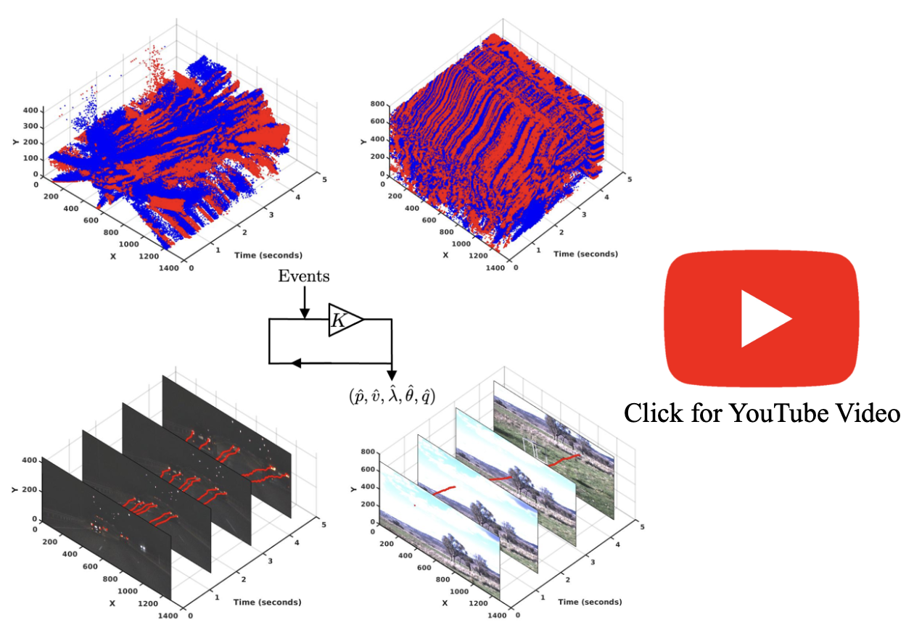

# Asynchronous Blob Tracker for Event Cameras

  

## For academic use only
Event-based cameras are popular for tracking fast-moving objects due to their high temporal resolution, low latency, and high dynamic range. In this paper, we propose a novel algorithm for tracking event blobs using raw events asynchronously in real time. We introduce the concept of an event blob as a spatio-temporal likelihood of event occurrence where the conditional spatial likelihood is blob-like. Many real-world objects such as car headlights or any quickly moving foreground objects generate event blob data. The proposed algorithm uses a nearest neighbour classifier with a dynamic threshold criteria for data association coupled with an extended Kalman filter to track the event blob state. Our algorithm achieves highly accurate blob tracking, velocity estimation, and shape estimation even under challenging lighting conditions and high-speed motions (> 11000 pixels/s). The microsecond time resolution achieved means that the filter output can be used to derive secondary information such as time-to-contact or range estimation, that will enable applications to real-world problems such as collision avoidance in autonomous driving.

The paper was accepted by the 2024 IEEE Transactions on Robotics (TRO). 

Ziwei Wang, Timothy Molloy, Pieter van Goor and Robert Mahony

[[PDF](https://arxiv.org/abs/2307.10593)] [[IEEE Xplore](https://aus01.safelinks.protection.outlook.com/?url=https%3A%2F%2Fieeexplore.ieee.org%2Fdocument%2F10665915&data=05%7C02%7Cziwei.wang1%40anu.edu.au%7C2e08dda55bb843ef030408dcce0aa7ff%7Ce37d725cab5c46249ae5f0533e486437%7C0%7C0%7C638611792406135514%7CUnknown%7CTWFpbGZsb3d8eyJWIjoiMC4wLjAwMDAiLCJQIjoiV2luMzIiLCJBTiI6Ik1haWwiLCJXVCI6Mn0%3D%7C0%7C%7C%7C&sdata=CPSoyUFhRltD8mFhVy4BSLGgRP4KWhWmAgY6miA1uio%3D&reserved=0)]

## Code and Data
We are currently working on making the codebase cleaner and more accessible, which will take some time. 

Please find the early release in [link](https://drive.google.com/drive/folders/1Z3G4i4RDG_SjCmTIxGdwXQaOa_mpX-il?usp=sharing) and follow the README file to run the code. 

## Citation
If you use or discuss our event blob tracking method, please cite our paper as follows:

<pre>

@Article{2024_Wang_AEB_Tracker_TRO,
  author  = {Ziwei Wang and Timothy Molloy and Pieter {van Goor} and Robert Mahony},
  journal = {IEEE Transactions on Robotics},
  title   = {Asynchronous Blob Tracker for Event Cameras},
  year    = {2024},
  volume  = {40},
  pages   = {4750-4767},
  issn    = {1552-3098},
  doi     = {10.1109/TRO.2024.3454410},
}
</pre>

## Notes
Should you have any questions or suggestions, please don't hesitate to get in touch with ziwei.wang1@anu.edu.au

